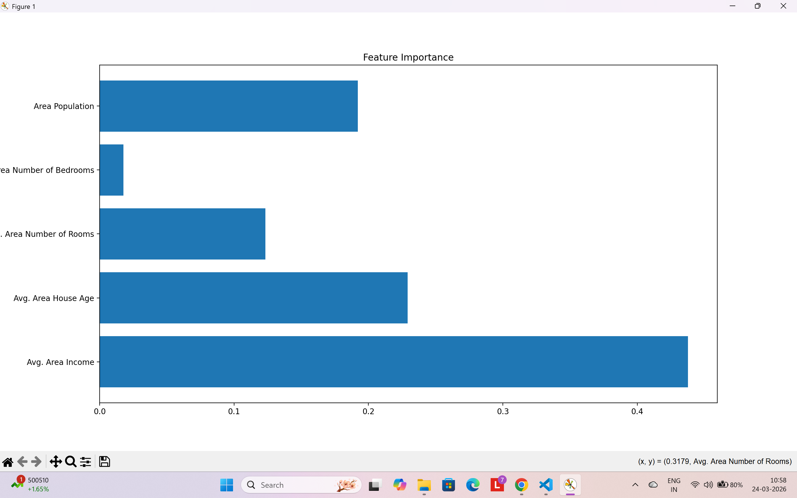

# 🏠 House Price Prediction Web App

## 🚀 Live Demo

👉 https://house-price-prediction-2-ohea.onrender.com

---

## 📌 Project Overview

This project is a Machine Learning web application that predicts house prices based on key features such as income, house age, number of rooms, bedrooms, and population.

The goal is to build an accurate prediction system and deploy it as a real-time web application using Flask.

---

## 🧠 Machine Learning Workflow

* Data Collection (`housing.csv`)
* Data Preprocessing
* Feature Selection
* Model Training
* Model Evaluation
* Model Deployment using Flask

---

## 🤖 Models Used

We trained and compared multiple machine learning models:

* Linear Regression
* Decision Tree Regressor
* Random Forest Regressor 🌲

---

## 📊 Model Performance

| Model             | MAE       | R² Score     |
| ----------------- | --------- | ------------ |
| Linear Regression | **80879** | **0.918** 🔥 |
| Random Forest 🌲  | 94511     | 0.883        |
| Decision Tree     | 140632    | 0.742        |

👉 **Linear Regression performed best** for this dataset.

---

## 🧠 Key Insight

Interestingly, Linear Regression outperformed Random Forest, indicating that the dataset has strong linear relationships between input features and house prices.

Random Forest introduced additional complexity, which slightly reduced performance in this case.

---

## 📊 Feature Importance (Random Forest)

Feature importance was analyzed using the Random Forest model to understand which factors influence house prices the most.

### 📌 Important Features:

* **Avg. Area Income** → Most important feature
* **Avg. Area Number of Rooms** → Strong positive impact
* **Area Population** → Moderate influence

---

## 🖼️ Output Screenshot


---

## 📈 Feature Importance Graph



---

## 📊 Input Features

* Avg. Area Income
* Avg. Area House Age
* Avg. Area Number of Rooms
* Avg. Area Number of Bedrooms
* Area Population

---

## 📈 Output

* Predicted House Price 💰

---

## 🛠️ Tech Stack

| Category     | Tools Used                  |
| ------------ | --------------------------- |
| Language     | Python 🐍                   |
| ML Libraries | Pandas, NumPy, Scikit-learn |
| Backend      | Flask                       |
| Frontend     | HTML, CSS                   |
| Deployment   | Render                      |

---

## ⚙️ How to Run Locally

### 1. Clone Repository

```bash
git clone https://github.com/Sivavardhank/House-Price-Prediction.git
cd House-Price-Prediction
```

### 2. Install Dependencies

```bash
pip install -r requirements.txt
```

### 3. Train Model

```bash
python train_model.py
```

### 4. Run Flask App

```bash
python app.py
```

---

## 📁 Project Structure

```
House-Price-Prediction/
│
├── app/
│   ├── static/
│   │   └── feature.png
│   └── templates/
│       └── index.html
│
├── data/
│   └── housing.csv
│
├── model/
│   └── house_price_model.pkl
│
├── train_model.py
├── app.py
├── requirements.txt
└── README.md
```

---

## 🔮 Future Improvements

* Add interactive dashboard (charts & insights)
* Hyperparameter tuning for better performance
* Add more advanced models like XGBoost
* Improve UI/UX design

---

## 🙌 Acknowledgements

* Dataset: Housing Dataset
* Scikit-learn Documentation

---

## 📬 Contact

If you have any questions or suggestions, feel free to connect!

---

⭐ If you like this project, give it a star!
