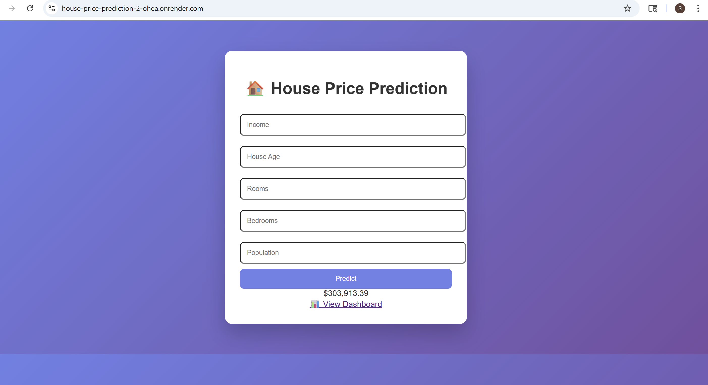

# 🏠 House Price Prediction using Machine Learning

## 📌 Project Overview

This project aims to predict house prices using Machine Learning techniques on the Boston Housing dataset.
The goal is to build a model that can accurately estimate housing prices based on various features such as number of rooms, crime rate, and socio-economic factors.

---

## 🚀 Features

* Data preprocessing and cleaning
* Model training using:

  * Linear Regression
  * Random Forest Regressor 🌲
* Model evaluation using MAE and R² score
* Feature importance analysis
* Visualization of results

---

## 📂 Dataset

* Dataset used: Boston Housing Dataset
* Contains 506 rows and 13 features
* Target variable: `medv` (Median house value)

---

## 🧠 Technologies Used

* Python 🐍
* Pandas
* NumPy
* Scikit-learn
* Matplotlib

---

## ⚙️ Project Workflow

1. Data Loading
2. Data Preprocessing
3. Train-Test Split
4. Model Training
5. Model Evaluation
6. Feature Importance Analysis

---

## 📊 Model Performance

| Model             | MAE      | R² Score |
| ----------------- | -------- | -------- |
| Linear Regression | 3.18     | 0.66     |
| Random Forest 🌲  | **2.11** | **0.87** |

👉 Random Forest outperformed Linear Regression by capturing non-linear relationships in the data.

---

## 🔍 Feature Importance Analysis

Feature importance was extracted from the Random Forest model to understand which features most influence house prices.

### 📌 Key Insights:

* **RM (Number of rooms)** → Most important feature
* **LSTAT (% lower income population)** → Strong negative impact on price
* **DIS (Distance to employment centers)** → Moderate influence

Other features like CRIM, TAX, PTRATIO have less impact.

---

---

## 🧠 Interpretation

* Houses with more rooms tend to have higher prices
* Areas with lower socio-economic conditions have lower house values
* Location plays a moderate role in pricing

---

## 💡 Why Random Forest?

* Handles non-linear relationships
* Reduces overfitting using multiple decision trees
* Provides feature importance for interpretability

---



## ▶️ How to Run the Project

1. Clone the repository:

```bash
git clone https://github.com/Sivavardhank/House-Price-Prediction.git
```

2. Navigate to the project folder:

```bash
cd House-Price-Prediction
```

3. Install dependencies:

```bash
pip install -r requirements.txt
```

4. Run the script:

```bash
python app.py
```

---

## 📁 Project Structure

```
House-Price-Prediction/
│
├── app.py
├── model.pkl
├── notebook.ipynb
├── requirements.txt
├── templates/
│   └── index.html
└── README.md
```

---

## 🔮 Future Improvements

* Deploy using Flask web application
* Add user interface for predictions
* Use advanced models like XGBoost
* Hyperparameter tuning for better accuracy

---

## 🙌 Acknowledgements

* Boston Housing Dataset
* Scikit-learn documentation

---

## 📬 Contact

If you have any questions or suggestions, feel free to reach out!

---

⭐ If you like this project, give it a star!
